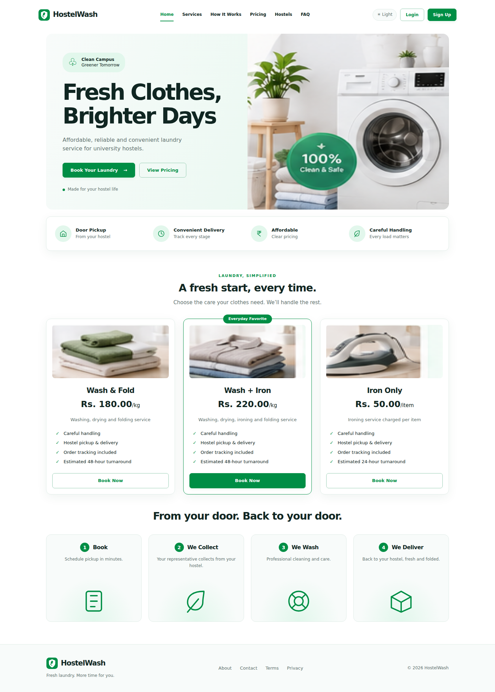
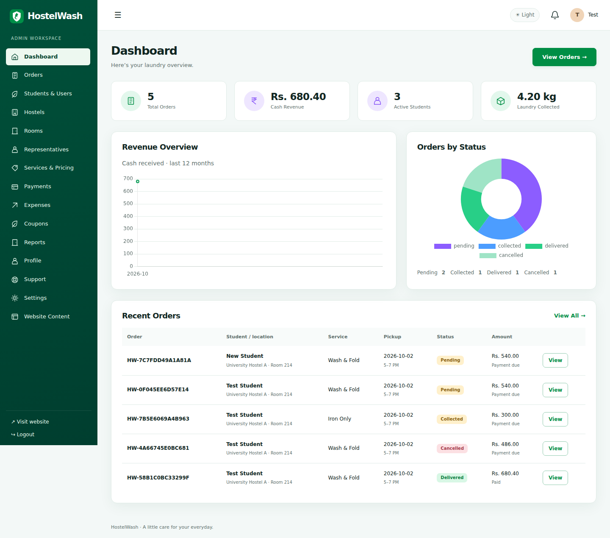
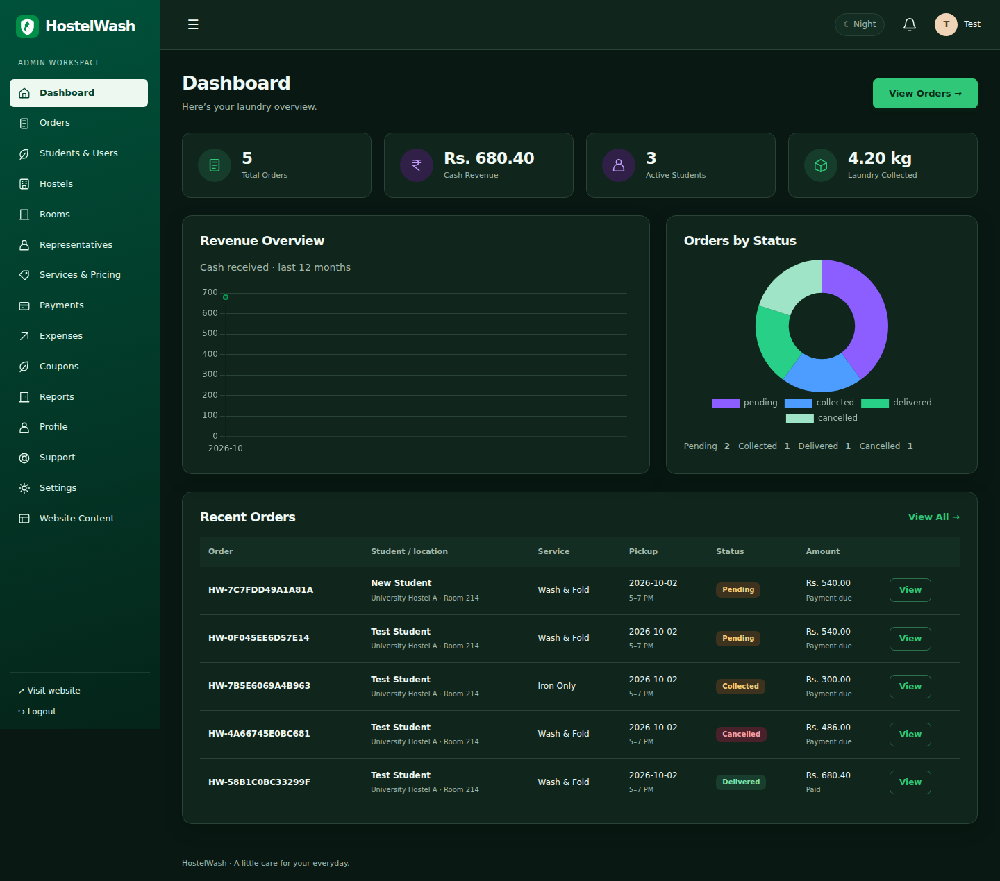
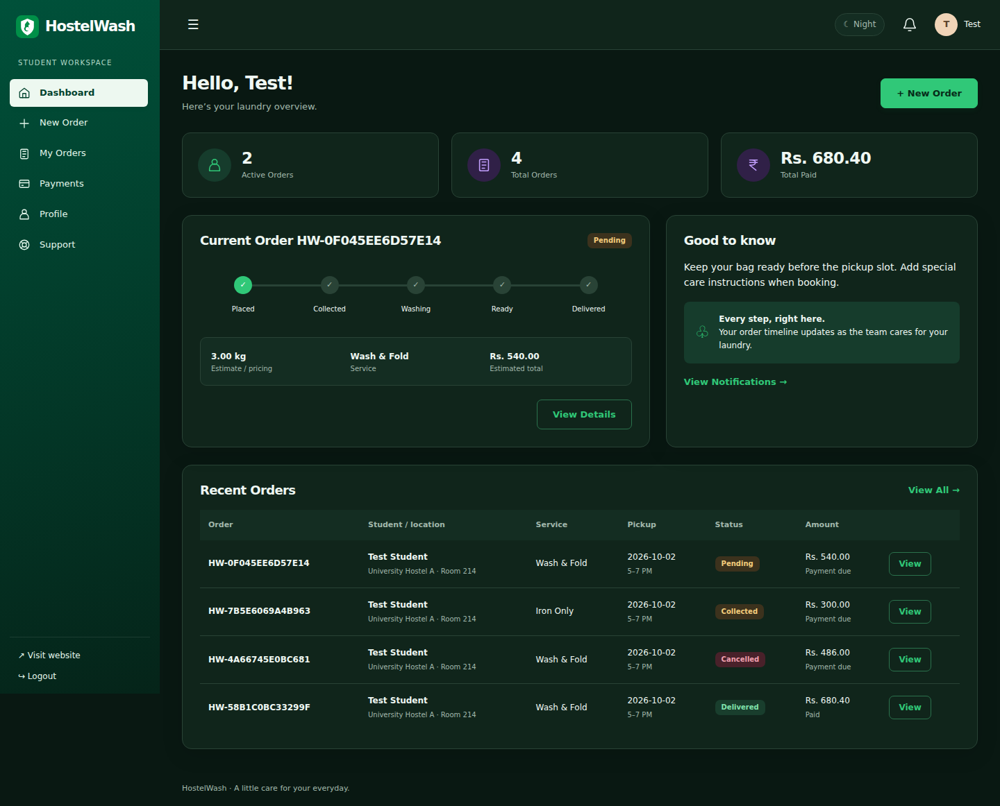
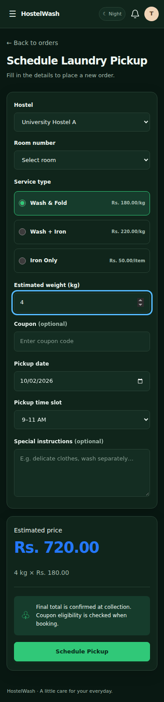
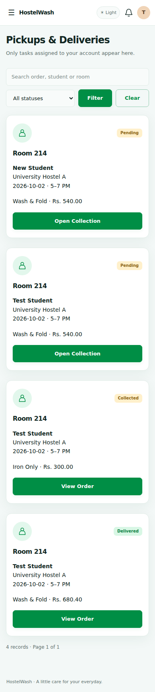
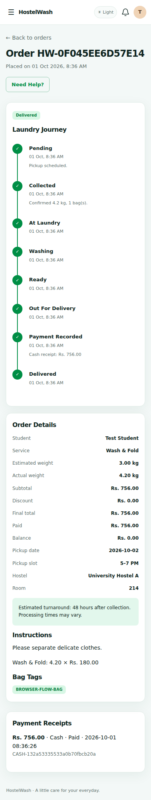

<<<<<<< HEAD
# HostelWash — Hostel Laundry Service Platform

**Fresh Clothes. Brighter Days.**

HostelWash is a full-stack laundry management application for university hostels, built with **PHP 8.2+, custom MVC, MySQL, Bootstrap 5, and vanilla JavaScript**. It connects students, hostel representatives, and administrators through a shared workflow for laundry booking, collection, processing, delivery, and cash payment tracking.

The platform includes a public website, a student portal, a mobile-friendly representative interface, and an administrative CMS. It supports multiple hostels, per-kilogram and per-item services, light and dark themes, and database-driven reporting.

**Developer:** [Ramzan Khan](https://github.com/codewithramzan)

[Features](#features) · [Screenshots](#screenshots) · [Installation](#installation) · [Architecture](#architecture) · [Testing](#testing) · [Documentation](#documentation)

## Project at a glance

| Area | Implementation |
|---|---|
| Backend | PHP 8.2+, custom MVC, PDO prepared statements |
| Database | MySQL / MariaDB; 18 relational tables |
| Frontend | HTML5, CSS3, Bootstrap 5, vanilla JavaScript |
| Charts | Chart.js with database-derived statistics |
| Access roles | Student, representative, administrator |
| Payments | Authorized staff recording of cash receipts |
| Reports | Date filters, CSV export, browser Print / Save PDF |
| Appearance | Responsive green interface, light/dark themes |
| Local environment | Laragon, Apache, PHP, MySQL |
| Build requirements | No Node.js, Composer installation, or frontend build required |

## The problem HostelWash addresses

Managing hostel laundry through paper records or scattered messages makes it difficult to track pickups, identify bags, confirm charges, and answer delivery questions. HostelWash keeps these tasks together so students can follow their orders and staff can manage the same records throughout the service cycle.

## Features

### Public website

- Homepage with service information and booking entry points.
- Services and pricing loaded from the database.
- Four-step explanation: book, collect, wash, deliver.
- Active hostel locations.
- About, FAQ, contact, terms, and privacy pages.
- Login, student registration, and account recovery.
- Administrator-editable homepage copy, business information, and policy text.

### Student portal

- Register, sign in, sign out, and manage profile details.
- Change passwords and request password-reset links.
- View active orders, order counts, recorded spending, and recent orders.
- Schedule pickups using an active hostel, room, service, date, and time slot.
- View dynamic price estimates and submit coupon codes.
- Add special care instructions.
- Track collection, laundry processing, and delivery through an order timeline.
- Review confirmed quantities, bag tags, final charges, and cash receipts.
- Cancel orders before collection.
- Submit support requests and read staff replies.
- View notifications and mark them as read.

### Representative interface

- Use a mobile-friendly view of assigned pickup and delivery tasks.
- Review student, hostel, room, service, pickup, and order information.
- Confirm actual laundry weight or whole-item count during collection.
- Record the number of bags and unique bag tags.
- Mark assigned orders as out for delivery and delivered.
- Record cash received for authorized delivery orders.
- Access only orders permitted by current assignments and hostel membership.

### Administration CMS

- View order totals, cash revenue, active student counts, and collected laundry weight.
- Explore revenue and order-status charts.
- Search, filter, paginate, and inspect orders.
- Update permitted laundry-processing stages.
- Assign or reassign representatives for eligible pickups and deliveries.
- Create accounts, review user history, and activate or deactivate users.
- Manage hostels, rooms, representatives, services, and prices.
- Manage fixed or percentage coupons with dates, minimum amounts, and usage limits.
- Add and edit expenses; filter by date and category.
- Review cash receipts and payment history.
- Reply to support requests and manage their status.
- Generate date-range reports, export CSV, and print or save reports as PDF.
- Configure contact details, pickup slots, and public website content.

### Shared interface

- Light and dark modes across public and authenticated pages.
- Theme persistence using `localStorage` under `hostelwash.theme`.
- System color preference detection when no theme has been saved.
- Responsive navigation and collapsible mobile sidebars.
- Independently scrolling sidebar menus.
- Form validation feedback, notifications, status badges, and empty states.
- Subtle transitions and support for reduced-motion preferences.

## Order lifecycle

| Stage | Responsible role | Action |
|---|---|---|
| Pending | Student | Schedules a pickup with estimated quantity and service selection. |
| Collected | Assigned representative or admin | Confirms quantity and bag tags; the server recalculates the final total. |
| At laundry | Admin | Records arrival at the processing location. |
| Washing | Admin | Starts the processing stage. |
| Ready | Admin | Marks the laundry ready for delivery. |
| Out for delivery | Assigned representative or admin | Records dispatch to the student. |
| Delivered | Assigned representative or admin | Confirms completion of delivery. |
| Cancelled | Owning student or admin | Cancels an order while it is still pending. |

Cash receipt recording is a separate action and does not advance the delivery status. Status changes are validated on the server and recorded in order history.

When an active representative is available for a hostel, new pickups are assigned according to the lowest open pickup count. Otherwise, the administrator can assign the task manually. Ready orders return to the active collecting representative where possible.

## Pricing and payments

- **Per-kilogram services:** the initial estimate uses estimated weight; final charges use confirmed collection weight.
- **Per-item services:** quantities must be whole numbers; final charges use the confirmed item count.
- **Accepted prices:** order items retain the unit price accepted at booking.
- **Coupons:** eligibility, dates, minimum value, and usage limits are checked server-side. Accepted coupon conditions are retained in protected storage.
- **Cash receipts:** authorized staff confirm money received. Students cannot mark their own orders as paid, and duplicate full-payment submissions are blocked.
- **Cash profit:** reports calculate received payment revenue minus recorded expenses for the selected period.

**Online payment gateways and wallet balances are not integrated.** The original database enum values are preserved, but they are not presented as working checkout methods. Post-collection cancellation and refund workflows are not implemented.

## Screenshots

The screenshots below show the application with test accounts and test orders. These records are not seeded into a normal installation.

### Public website



### Admin dashboard — light and dark

| Light mode | Dark mode |
|---|---|
|  |  |

### Student dashboard



### Mobile workflows

| Schedule a pickup | Representative tasks | Order tracking |
|---|---|---|
|  |  |  |

The photo treatments reuse regions of the supplied design reference and retain that image’s original resolution. Additional screenshots are available in [`docs/screenshots`](docs/screenshots/).

## Requirements

- PHP **8.2 or newer**.
- PHP extensions: `pdo_mysql`, `mbstring`, `session`, and `json`.
- MySQL **8+** or MariaDB **10.6+**; the build was validated against MariaDB 10.11.
- Apache 2.4 with `mod_rewrite`, or PHP’s development server for local use.
- Writable application storage directories.

Bootstrap CSS and Chart.js are bundled locally. Application PHP, views, CSS, and JavaScript are readable source; third-party distribution files retain their original formatting and license notices.

## Installation

### 1. Get the project

For a new checkout, run these commands in PowerShell:

```powershell
cd C:\laragon\www

git clone https://github.com/codewithramzan/HostelWash-Laundury-Plateform.git hostelwash

cd hostelwash
```

If you already extracted or cloned the project, use the existing folder instead. The clone URL above follows the current repository name.

### 2. Start the local services

Open Laragon and start **Apache** and **MySQL**.

### 3. Import the database

Open phpMyAdmin and import:

```text
database/hostelwash.sql
```

The complete SQL file creates and selects the `hostelwash` database, creates its 18 tables, and seeds the required roles, order statuses, and initial services. The supplied schema is preserved without application-specific migrations.

### 4. Configure the environment

Copy the example file:

```powershell
Copy-Item .env.example .env
```

Edit `.env` to match your local configuration:

```dotenv
APP_NAME=HostelWash
APP_ENV=local
APP_URL=http://hostelwash.test
APP_TIMEZONE=Asia/Karachi

=======
HostelWash — Hostel Laundry Service Platform
Fresh Clothes. Brighter Days.
HostelWash is a full-stack laundry management application for university hostels, built with PHP 8.2+, custom MVC, MySQL, Bootstrap 5, and vanilla JavaScript. It connects students, hostel representatives, and administrators through a shared workflow for laundry booking, collection, processing, delivery, and cash payment tracking.
The platform includes a public website, a student portal, a mobile-friendly representative interface, and an administrative CMS. It supports multiple hostels, per-kilogram and per-item services, light and dark themes, and database-driven reporting.
Developer: Ramzan Khan
Features · Screenshots · Installation · Architecture · Testing · Documentation
Project at a glance
Area	Implementation
Backend	PHP 8.2+, custom MVC, PDO prepared statements
Database	MySQL / MariaDB; 18 relational tables
Frontend	HTML5, CSS3, Bootstrap 5, vanilla JavaScript
Charts	Chart.js with database-derived statistics
Access roles	Student, representative, administrator
Payments	Authorized staff recording of cash receipts
Reports	Date filters, CSV export, browser Print / Save PDF
Appearance	Responsive green interface, light/dark themes
Local environment	Laragon, Apache, PHP, MySQL
Build requirements	No Node.js, Composer installation, or frontend build required


The problem HostelWash addresses
Managing hostel laundry through paper records or scattered messages makes it difficult to track pickups, identify bags, confirm charges, and answer delivery questions. HostelWash keeps these tasks together so students can follow their orders and staff can manage the same records throughout the service cycle.
Features
Public website
- Homepage with service information and booking entry points.
- Services and pricing loaded from the database.
- Four-step explanation: book, collect, wash, deliver.
- Active hostel locations.
- About, FAQ, contact, terms, and privacy pages.
- Login, student registration, and account recovery.
- Administrator-editable homepage copy, business information, and policy text.
Student portal
- Register, sign in, sign out, and manage profile details.
- Change passwords and request password-reset links.
- View active orders, order counts, recorded spending, and recent orders.
- Schedule pickups using an active hostel, room, service, date, and time slot.
- View dynamic price estimates and submit coupon codes.
- Add special care instructions.
- Track collection, laundry processing, and delivery through an order timeline.
- Review confirmed quantities, bag tags, final charges, and cash receipts.
- Cancel orders before collection.
- Submit support requests and read staff replies.
- View notifications and mark them as read.
Representative interface
- Use a mobile-friendly view of assigned pickup and delivery tasks.
- Review student, hostel, room, service, pickup, and order information.
- Confirm actual laundry weight or whole-item count during collection.
- Record the number of bags and unique bag tags.
- Mark assigned orders as out for delivery and delivered.
- Record cash received for authorized delivery orders.
- Access only orders permitted by current assignments and hostel membership.
Administration CMS
- View order totals, cash revenue, active student counts, and collected laundry weight.
- Explore revenue and order-status charts.
- Search, filter, paginate, and inspect orders.
- Update permitted laundry-processing stages.
- Assign or reassign representatives for eligible pickups and deliveries.
- Create accounts, review user history, and activate or deactivate users.
- Manage hostels, rooms, representatives, services, and prices.
- Manage fixed or percentage coupons with dates, minimum amounts, and usage limits.
- Add and edit expenses; filter by date and category.
- Review cash receipts and payment history.
- Reply to support requests and manage their status.
- Generate date-range reports, export CSV, and print or save reports as PDF.
- Configure contact details, pickup slots, and public website content.
Shared interface
- Light and dark modes across public and authenticated pages.
- Theme persistence using localStorage under hostelwash.theme.
- System color preference detection when no theme has been saved.
- Responsive navigation and collapsible mobile sidebars.
- Independently scrolling sidebar menus.
- Form validation feedback, notifications, status badges, and empty states.
- Subtle transitions and support for reduced-motion preferences.
Order lifecycle
Stage	Responsible role	Action
Pending	Student	Schedules a pickup with estimated quantity and service selection.
Collected	Assigned representative or admin	Confirms quantity and bag tags; the server recalculates the final total.
At laundry	Admin	Records arrival at the processing location.
Washing	Admin	Starts the processing stage.
Ready	Admin	Marks the laundry ready for delivery.
Out for delivery	Assigned representative or admin	Records dispatch to the student.
Delivered	Assigned representative or admin	Confirms completion of delivery.
Cancelled	Owning student or admin	Cancels an order while it is still pending.


Cash receipt recording is a separate action and does not advance the delivery status. Status changes are validated on the server and recorded in order history.
When an active representative is available for a hostel, new pickups are assigned according to the lowest open pickup count. Otherwise, the administrator can assign the task manually. Ready orders return to the active collecting representative where possible.
Pricing and payments
- Per-kilogram services: the initial estimate uses estimated weight; final charges use confirmed collection weight.
- Per-item services: quantities must be whole numbers; final charges use the confirmed item count.
- Accepted prices: order items retain the unit price accepted at booking.
- Coupons: eligibility, dates, minimum value, and usage limits are checked server-side. Accepted coupon conditions are retained in protected storage.
- Cash receipts: authorized staff confirm money received. Students cannot mark their own orders as paid, and duplicate full-payment submissions are blocked.
- Cash profit: reports calculate received payment revenue minus recorded expenses for the selected period.
Online payment gateways and wallet balances are not integrated. The original database enum values are preserved, but they are not presented as working checkout methods. Post-collection cancellation and refund workflows are not implemented.
Screenshots
The screenshots below show the application with test accounts and test orders. These records are not seeded into a normal installation.
Public website
 
Admin dashboard — light and dark
Light mode	Dark mode
	


Student dashboard
 
Mobile workflows
Schedule a pickup	Representative tasks	Order tracking
		


The photo treatments reuse regions of the supplied design reference and retain that image’s original resolution. Additional screenshots are available in [`docs/screenshots`](docs/screenshots/).
Requirements
- PHP 8.2 or newer.
- PHP extensions: pdo_mysql, mbstring, session, and json.
- MySQL 8+ or MariaDB 10.6+; the build was validated against MariaDB 10.11.
- Apache 2.4 with mod_rewrite, or PHP’s development server for local use.
- Writable application storage directories.
Bootstrap CSS and Chart.js are bundled locally. Application PHP, views, CSS, and JavaScript are readable source; third-party distribution files retain their original formatting and license notices.
Installation
1. Get the project
For a new checkout, run these commands in PowerShell:
cd C:\laragon\www

git clone https://github.com/codewithramzan/HostelWash-Laundury-Plateform.git hostelwash

cd hostelwash
If you already extracted or cloned the project, use the existing folder instead. The clone URL above follows the current repository name.
2. Start the local services
Open Laragon and start Apache and MySQL.
3. Import the database
Open phpMyAdmin and import:
database/hostelwash.sql
The complete SQL file creates and selects the hostelwash database, creates its 18 tables, and seeds the required roles, order statuses, and initial services. The supplied schema is preserved without application-specific migrations.
4. Configure the environment
Copy the example file:
Copy-Item .env.example .env
Edit .env to match your local configuration:
APP_NAME=HostelWash
APP_ENV=local
APP_URL=http://hostelwash.test
APP_TIMEZONE=Asia/Karachi

>>>>>>> ef2cc2e5b4b7213f5013b6cc7b7d54ea33e2a266
DB_HOST=127.0.0.1
DB_PORT=3306
DB_DATABASE=hostelwash
DB_USERNAME=root
DB_PASSWORD=
<<<<<<< HEAD

MAIL_ENABLED=false
MAIL_FROM=no-reply@hostelwash.test
REQUIRE_EMAIL_VERIFICATION=false
```

An empty database password is appropriate only if that matches your local MySQL configuration. Keep actual credentials in `.env`, which is excluded from Git.

### 5. Configure the public document root

The website must serve **`hostelwash/public`**, not the project root.

Example Apache virtual host:
=======
>>>>>>> ef2cc2e5b4b7213f5013b6cc7b7d54ea33e2a266

MAIL_ENABLED=false
MAIL_FROM=no-reply@hostelwash.test
REQUIRE_EMAIL_VERIFICATION=false
An empty database password is appropriate only if that matches your local MySQL configuration. Keep actual credentials in .env, which is excluded from Git.
5. Configure the public document root
The website must serve hostelwash/public, not the project root.
Example Apache virtual host:
<VirtualHost *:80>
    ServerName hostelwash.test
    DocumentRoot "C:/laragon/www/hostelwash/public"

    <Directory "C:/laragon/www/hostelwash/public">
        AllowOverride All
        Require all granted
        Options -Indexes +FollowSymLinks
    </Directory>
</VirtualHost>
<<<<<<< HEAD
```

Adapt the path if Laragon is installed on a different drive. Virtual-host files are commonly located under `C:\laragon\etc\apache2\sites-enabled`. If editing a generated `auto.*.conf` file, remove the `auto.` prefix from its filename so your custom configuration is retained.

Ensure the Windows hosts file contains:

```text
127.0.0.1 hostelwash.test
```

Laragon’s automatic virtual-host feature normally manages this entry. Reload Apache after changing its configuration.

### 6. Check the environment and create an administrator

From Laragon Terminal in the project folder:

```powershell
php bin/doctor.php
php bin/create-admin.php
```

Enter your administrator name, email, and a unique password of 10–72 characters.

**There is no default administrator account or shared password.** The setup command creates an account and does not overwrite an existing one.

### 7. Open the application

Visit:

```text
http://hostelwash.test
```

Administrator login:

```text
http://hostelwash.test/login
```

### Alternative: PHP development server

If you prefer not to configure Apache for local testing, set:

```dotenv
APP_URL=http://127.0.0.1:8000
```

Then run:

```powershell
php -S 127.0.0.1:8000 -t public public/router.php
```

Open `http://127.0.0.1:8000` and keep the terminal running. This server is for local development, not public production traffic.

## First-time business setup

After signing in as an administrator:

1. Add your real hostels under **Hostels**.
2. Add active rooms under **Rooms**.
3. Review the seeded services, prices, and estimated turnaround times.
4. Create a representative account under **Students & Users**.
5. Connect that account to a hostel under **Representatives**.
6. Set contact information and pickup slots under **Settings**.
7. Review the public copy and policies under **Website Content**.
8. Register a student in another browser session and complete a test booking.
9. Follow the order through collection, processing, cash receipt, and delivery.

Optional local demo hostels and rooms:

```powershell
php bin/demo-data.php --confirm
```

This command is restricted to `APP_ENV=local`. It creates two demo hostels and eight rooms, without adding users, shared passwords, fake orders, or fabricated revenue.

## Authentication and email

Authentication uses password hashing, session regeneration, server-side role checks, and CSRF protection.

### Local password-reset emails

With local mail disabled, reset and verification messages are written to a protected outbox. Request a link on `/forgot`, then read the local messages with:

```powershell
=======
Adapt the path if Laragon is installed on a different drive. Virtual-host files are commonly located under C:\laragon\etc\apache2\sites-enabled. If editing a generated auto.*.conf file, remove the auto. prefix from its filename so your custom configuration is retained.
Ensure the Windows hosts file contains:
127.0.0.1 hostelwash.test
Laragon’s automatic virtual-host feature normally manages this entry. Reload Apache after changing its configuration.
6. Check the environment and create an administrator
From Laragon Terminal in the project folder:
php bin/doctor.php
php bin/create-admin.php
Enter your administrator name, email, and a unique password of 10–72 characters.
There is no default administrator account or shared password. The setup command creates an account and does not overwrite an existing one.
7. Open the application
Visit:
http://hostelwash.test
Administrator login:
http://hostelwash.test/login
Alternative: PHP development server
If you prefer not to configure Apache for local testing, set:
APP_URL=http://127.0.0.1:8000
Then run:
php -S 127.0.0.1:8000 -t public public/router.php
Open http://127.0.0.1:8000 and keep the terminal running. This server is for local development, not public production traffic.
First-time business setup
After signing in as an administrator:
1. Add your real hostels under Hostels.
2. Add active rooms under Rooms.
3. Review the seeded services, prices, and estimated turnaround times.
4. Create a representative account under Students & Users.
5. Connect that account to a hostel under Representatives.
6. Set contact information and pickup slots under Settings.
7. Review the public copy and policies under Website Content.
8. Register a student in another browser session and complete a test booking.
9. Follow the order through collection, processing, cash receipt, and delivery.
Optional local demo hostels and rooms:
php bin/demo-data.php --confirm
This command is restricted to APP_ENV=local. It creates two demo hostels and eight rooms, without adding users, shared passwords, fake orders, or fabricated revenue.
Authentication and email
Authentication uses password hashing, session regeneration, server-side role checks, and CSRF protection.
Local password-reset emails
With local mail disabled, reset and verification messages are written to a protected outbox. Request a link on /forgot, then read the local messages with:
>>>>>>> ef2cc2e5b4b7213f5013b6cc7b7d54ea33e2a266
php bin/read-mail.php
Open the link shown in your terminal. Tokens expire after one hour and are single-use. The public recovery response does not disclose whether an email address has an account.
Actual email delivery
Configure the host’s PHP mail transport and set:
MAIL_ENABLED=true
MAIL_FROM=your-configured-sender@example.com
The implementation uses PHP mail(); it does not include an SMTP client. Verify delivery on the target host before enabling account workflows that depend on email.
Optional student email verification:
REQUIRE_EMAIL_VERIFICATION=true
Administrator-created accounts are marked verified. Existing unverified students can request a verification link through account recovery. Persistent “remember me” login is not implemented.
Architecture
Requests enter through public/index.php. The router selects a controller, services enforce business rules, and models execute prepared database operations. Views render the returned data through shared layouts and components.
Directory / file	Responsibility
app/Controllers/	Public pages, authentication, dashboards, orders, accounts, and administration
app/Models/DB.php	PDO connection, prepared statements, and transactions
app/Models/Order.php	Order queries, pagination, and user-specific access scope
app/Services/	Booking, pricing, lifecycle, assignments, tokens, settings, and private storage
app/Middleware/	Authentication, authorization, and CSRF checks
app/Validators/	Shared input validation
app/Helpers/	Escaping, URLs, views, formatting, and local icons
app/Views/	Public, authentication, portal, and admin templates
config/	Bootstrap configuration and editable-resource allowlists
routes/web.php	HTTP route definitions
database/hostelwash.sql	Original database schema and lookup seeds
public/assets/	Application styles, scripts, images, and bundled vendors
storage/private/	Supplementary protected application data
storage/sessions/	PHP session files
storage/logs/	Application logs
bin/	Setup, diagnostics, sample locations, and local mail commands
tests/	Guarded backend integration tests
docs/	Screenshots, schema illustration, and validation output

<<<<<<< HEAD
Open the link shown in your terminal. Tokens expire after one hour and are single-use. The public recovery response does not disclose whether an email address has an account.

### Actual email delivery

Configure the host’s PHP mail transport and set:

```dotenv
MAIL_ENABLED=true
MAIL_FROM=your-configured-sender@example.com
```

The implementation uses PHP `mail()`; it does not include an SMTP client. Verify delivery on the target host before enabling account workflows that depend on email.

Optional student email verification:

```dotenv
REQUIRE_EMAIL_VERIFICATION=true
```

Administrator-created accounts are marked verified. Existing unverified students can request a verification link through account recovery. Persistent “remember me” login is not implemented.

## Architecture

Requests enter through `public/index.php`. The router selects a controller, services enforce business rules, and models execute prepared database operations. Views render the returned data through shared layouts and components.

| Directory / file | Responsibility |
|---|---|
| `app/Controllers/` | Public pages, authentication, dashboards, orders, accounts, and administration |
| `app/Models/DB.php` | PDO connection, prepared statements, and transactions |
| `app/Models/Order.php` | Order queries, pagination, and user-specific access scope |
| `app/Services/` | Booking, pricing, lifecycle, assignments, tokens, settings, and private storage |
| `app/Middleware/` | Authentication, authorization, and CSRF checks |
| `app/Validators/` | Shared input validation |
| `app/Helpers/` | Escaping, URLs, views, formatting, and local icons |
| `app/Views/` | Public, authentication, portal, and admin templates |
| `config/` | Bootstrap configuration and editable-resource allowlists |
| `routes/web.php` | HTTP route definitions |
| `database/hostelwash.sql` | Original database schema and lookup seeds |
| `public/assets/` | Application styles, scripts, images, and bundled vendors |
| `storage/private/` | Supplementary protected application data |
| `storage/sessions/` | PHP session files |
| `storage/logs/` | Application logs |
| `bin/` | Setup, diagnostics, sample locations, and local mail commands |
| `tests/` | Guarded backend integration tests |
| `docs/` | Screenshots, schema illustration, and validation output |

### Database modules

| Domain | Tables |
|---|---|
| Users and access | `roles`, `users` |
| Hostel operations | `hostels`, `rooms`, `representatives` |
| Catalog and discounts | `services`, `coupons` |
| Orders and tracking | `orders`, `order_items`, `order_statuses`, `order_status_history` |
| Collection and delivery | `pickup_assignments`, `delivery_assignments`, `bag_tags` |
| Financial records | `payments`, `expenses` |
| Support and communication | `complaints`, `notifications` |

See [`DATABASE_MAP.md`](DATABASE_MAP.md) for keys, relationships, and feature mappings.

## Security measures

=======

Database modules
Domain	Tables
Users and access	roles, users
Hostel operations	hostels, rooms, representatives
Catalog and discounts	services, coupons
Orders and tracking	orders, order_items, order_statuses, order_status_history
Collection and delivery	pickup_assignments, delivery_assignments, bag_tags
Financial records	payments, expenses
Support and communication	complaints, notifications


See [`DATABASE_MAP.md`](DATABASE_MAP.md) for keys, relationships, and feature mappings.
Security measures
>>>>>>> ef2cc2e5b4b7213f5013b6cc7b7d54ea33e2a266
- PDO prepared statements and explicit editable-field allowlists.
- Password hashing and verification.
- Session regeneration and HTTP-only, SameSite cookies; secure cookies for configured HTTPS URLs.
- Database-backed account status and role validation on authenticated requests.
- CSRF checks on state-changing forms.
- Output escaping and bounded server-side input validation.
- Order ownership, assignment, and hostel authorization checks.
- Server-calculated prices, coupon eligibility, and payment balances.
- Transactions and row locks for critical order and financial operations.
- Duplicate full-payment prevention and unique bag-tag constraints.
- Rate limits for sensitive account actions.
- Expiring, single-use reset and verification tokens.
- Protected private storage and public-directory separation.
<<<<<<< HEAD

These controls have functional test coverage; the project has not undergone a formal penetration test or load certification.
=======
These controls have functional test coverage; the project has not undergone a formal penetration test or load certification.
Storage and backups
The original SQL schema does not contain tables for settings, CMS copy, reset/verification tokens, support replies, or pricing metadata. This version stores those supplementary records in protected JSON files with file locking and atomic replacement.
Deploy this version to a single application server with persistent storage. Back up the database and storage/private together. Existing bookings require their accepted pricing snapshots to complete collection correctly.
Session files can be cleared to sign users out. Keep private storage and logs outside public web access. Proposed future database additions are documented in [`DATABASE_CHANGE_PROPOSAL.md`](DATABASE_CHANGE_PROPOSAL.md); no such migration has been applied.
Testing
The packaged build was checked using PHP 8.3.6, MariaDB 10.11.14, and Chromium:
Validation	Result recorded for the packaged build
Backend integration	34 checks passed
HTTP routes and actions	53 checks passed
Responsive page/viewport combinations	48 combinations checked
Theme and UI behavior	Persistence, navigation, room filtering, estimates, and chart initialization checked
Full browser workflow	Collection → processing → cash receipt → delivery → student tracking passed
Source syntax	PHP and JavaScript checks passed
Schema preservation	SQL checksum matched the supplied file
>>>>>>> ef2cc2e5b4b7213f5013b6cc7b7d54ea33e2a266


<<<<<<< HEAD
The original SQL schema does not contain tables for settings, CMS copy, reset/verification tokens, support replies, or pricing metadata. This version stores those supplementary records in protected JSON files with file locking and atomic replacement.

Deploy this version to a **single application server with persistent storage**. Back up the database and **`storage/private` together**. Existing bookings require their accepted pricing snapshots to complete collection correctly.

Session files can be cleared to sign users out. Keep private storage and logs outside public web access. Proposed future database additions are documented in [`DATABASE_CHANGE_PROPOSAL.md`](DATABASE_CHANGE_PROPOSAL.md); no such migration has been applied.

## Testing

The packaged build was checked using PHP 8.3.6, MariaDB 10.11.14, and Chromium:

| Validation | Result recorded for the packaged build |
|---|---|
| Backend integration | 34 checks passed |
| HTTP routes and actions | 53 checks passed |
| Responsive page/viewport combinations | 48 combinations checked |
| Theme and UI behavior | Persistence, navigation, room filtering, estimates, and chart initialization checked |
| Full browser workflow | Collection → processing → cash receipt → delivery → student tracking passed |
| Source syntax | PHP and JavaScript checks passed |
| Schema preservation | SQL checksum matched the supplied file |

See [`TEST_REPORT.md`](TEST_REPORT.md) and [`docs/validation-output.txt`](docs/validation-output.txt). These results describe the delivered build; they are not a live CI status for subsequent repository changes.

### Running backend integration tests

Use a separate disposable test checkout and database:

1. Create a database whose name ends in `_test`.
2. Import a **test copy** of the schema with its `CREATE DATABASE` and `USE` statements targeting that database. Keep the original SQL unchanged.
3. In the test checkout’s `.env`, set `APP_ENV=testing`, set `DB_DATABASE` to the test database, and configure the connection.
4. Run:

```powershell
php tests/integration.php
```

The test inserts named fixtures and supplementary private files. Use a fresh test database for each run, and do not run it against business data. The guard requires both testing mode and a database name ending in `_test`.
=======
See [`TEST_REPORT.md`](TEST_REPORT.md) and [`docs/validation-output.txt`](docs/validation-output.txt). These results describe the delivered build; they are not a live CI status for subsequent repository changes.
Running backend integration tests
Use a separate disposable test checkout and database:
1. Create a database whose name ends in _test.
2. Import a test copy of the schema with its CREATE DATABASE and USE statements targeting that database. Keep the original SQL unchanged.
3. In the test checkout’s .env, set APP_ENV=testing, set DB_DATABASE to the test database, and configure the connection.
4. Run:
php tests/integration.php
The test inserts named fixtures and supplementary private files. Use a fresh test database for each run, and do not run it against business data. The guard requires both testing mode and a database name ending in _test.
Deployment
1. Use hosting that supports PHP and MySQL/MariaDB.
2. Point the domain’s document root to public/.
3. Keep .env, source code, database files, command-line scripts, logs, and private storage outside the public directory.
4. Configure the production database with an application-specific user.
5. Set APP_ENV=production and the correct HTTPS APP_URL.
6. Configure PHP mail delivery if password recovery or verification will be used.
7. Grant the PHP worker the required storage permissions.
8. Retain the Apache rewrite configuration, configure backups, and complete a staff/student acceptance test.
For shared hosting with a fixed htdocs directory, place only the public files there, keep the private application separately, and update the bootstrap path in index.php accordingly.
The root .htaccess denies access by default. A homepage 403 usually means the document root needs correcting; do not remove the root protection to expose the entire project.
Troubleshooting
Problem	What to check
Database unavailable	Start MySQL, verify .env, import the SQL, and run php bin/doctor.php.
#1046 No database selected	Import the complete SQL with its database-selection statements. On restricted hosting, select the assigned database and adapt those statements in a deployment copy.
Homepage returns 403	Set DocumentRoot to hostelwash/public.
/login returns 404	Enable mod_rewrite, AllowOverride All, and retain public/.htaccess.
Missing CSS or incorrect links	Make APP_URL match the domain and port you actually use.
Session or CSRF errors	Check PHP sessions and write permissions for storage/sessions.
No available rooms	Create active rooms under the selected active hostel.
Representative sees no tasks	Check hostel membership, account status, and the order’s assignment.
No reset email locally	Read the protected outbox with php bin/read-mail.php.
Duplicate record error	Check unique email, phone, hostel/service name, coupon code, or bag tag.
Private storage error	Check persistent disk and PHP worker permissions on the storage directories.
>>>>>>> ef2cc2e5b4b7213f5013b6cc7b7d54ea33e2a266


<<<<<<< HEAD
1. Use hosting that supports PHP and MySQL/MariaDB.
2. Point the domain’s document root to `public/`.
3. Keep `.env`, source code, database files, command-line scripts, logs, and private storage outside the public directory.
4. Configure the production database with an application-specific user.
5. Set `APP_ENV=production` and the correct HTTPS `APP_URL`.
6. Configure PHP mail delivery if password recovery or verification will be used.
7. Grant the PHP worker the required storage permissions.
8. Retain the Apache rewrite configuration, configure backups, and complete a staff/student acceptance test.

For shared hosting with a fixed `htdocs` directory, place only the public files there, keep the private application separately, and update the bootstrap path in `index.php` accordingly.

The root `.htaccess` denies access by default. A homepage 403 usually means the document root needs correcting; do not remove the root protection to expose the entire project.

## Troubleshooting

| Problem | What to check |
|---|---|
| Database unavailable | Start MySQL, verify `.env`, import the SQL, and run `php bin/doctor.php`. |
| `#1046 No database selected` | Import the complete SQL with its database-selection statements. On restricted hosting, select the assigned database and adapt those statements in a deployment copy. |
| Homepage returns 403 | Set DocumentRoot to `hostelwash/public`. |
| `/login` returns 404 | Enable mod_rewrite, AllowOverride All, and retain `public/.htaccess`. |
| Missing CSS or incorrect links | Make APP_URL match the domain and port you actually use. |
| Session or CSRF errors | Check PHP sessions and write permissions for `storage/sessions`. |
| No available rooms | Create active rooms under the selected active hostel. |
| Representative sees no tasks | Check hostel membership, account status, and the order’s assignment. |
| No reset email locally | Read the protected outbox with `php bin/read-mail.php`. |
| Duplicate record error | Check unique email, phone, hostel/service name, coupon code, or bag tag. |
| Private storage error | Check persistent disk and PHP worker permissions on the storage directories. |

## Documentation

=======
Documentation
>>>>>>> ef2cc2e5b4b7213f5013b6cc7b7d54ea33e2a266
- [`START_HERE.txt`](START_HERE.txt) — short local setup checklist.
- [`PROJECT_ANALYSIS.md`](PROJECT_ANALYSIS.md) — scope and implementation decisions.
- [`DATABASE_MAP.md`](DATABASE_MAP.md) — tables, relationships, and feature mapping.
- [`DATABASE_CHANGE_PROPOSAL.md`](DATABASE_CHANGE_PROPOSAL.md) — documented schema gaps and future options.
- [`TEST_REPORT.md`](TEST_REPORT.md) — validation results and limits.
- [`THIRD_PARTY_NOTICES.md`](THIRD_PARTY_NOTICES.md) — bundled dependency notices.
<<<<<<< HEAD

## Current scope

HostelWash is a responsive web application, not a native Android or iOS app. It supports cash receipt recording, with no connected online gateway or wallet ledger. Email delivery requires host configuration. Legal and business policy text should be reviewed by the service operator. The current storage design assumes one application server.

## Author

**Ramzan Khan** — Full-Stack PHP Developer

- GitHub: [codewithramzan](https://github.com/codewithramzan)
- LinkedIn: [ramzan-dev](https://www.linkedin.com/in/ramzan-dev/)

## Contributions and licensing

Bug reports and focused improvement suggestions are welcome. Include the relevant page, expected behavior, reproduction steps, and environment details. Keep credentials, session files, private records, and real customer data out of commits and issue attachments.

A project-wide license has not been added to this package. Bundled Bootstrap and Chart.js distributions retain their MIT license terms; see [`THIRD_PARTY_NOTICES.md`](THIRD_PARTY_NOTICES.md).
=======
Current scope
HostelWash is a responsive web application, not a native Android or iOS app. It supports cash receipt recording, with no connected online gateway or wallet ledger. Email delivery requires host configuration. Legal and business policy text should be reviewed by the service operator. The current storage design assumes one application server.
Author
Ramzan Khan — Full-Stack PHP Developer
- GitHub: codewithramzan
- LinkedIn: ramzan-dev
Contributions and licensing
Bug reports and focused improvement suggestions are welcome. Include the relevant page, expected behavior, reproduction steps, and environment details. Keep credentials, session files, private records, and real customer data out of commits and issue attachments.
A project-wide license has not been added to this package. Bundled Bootstrap and Chart.js distributions retain their MIT license terms; see [`THIRD_PARTY_NOTICES.md`](THIRD_PARTY_NOTICES.md)
>>>>>>> ef2cc2e5b4b7213f5013b6cc7b7d54ea33e2a266
